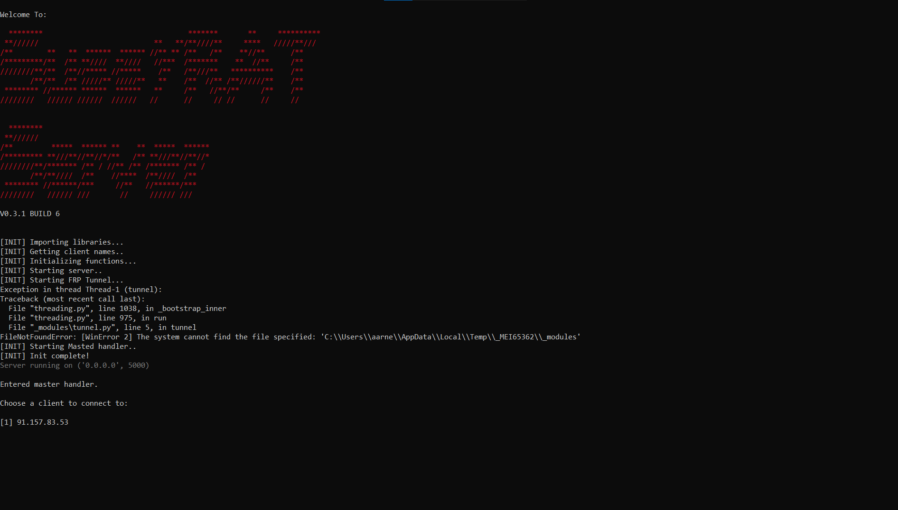

# rat

 ikr

## Use

You can use this freely as long as it is for educational purposes only.
I am not responsible for anything caused by this software.

## Features

### Client

1. Keylog
2. Persistence (starts again on login)
3. Hidden (Doesent have a console window)
4. Can get location info of victim easily using location module
5. FRP

### Server

1. Multi-Client support
2. Cool af banner
3. Set names for ips
4. FRP

## HOW to use

- Run server
- Run client
- You now have access to the client's computer...

### Naming ips

You can name ips using this command while connected to a client.

```python
.name set <name>
```

# Images



[Omg ip leaked](get_baited.gif)
